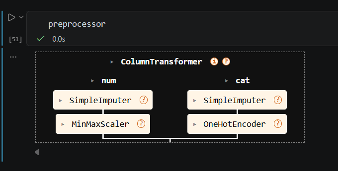
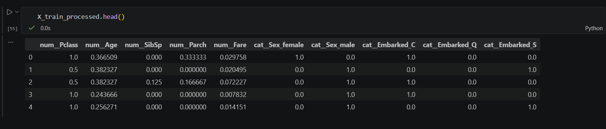
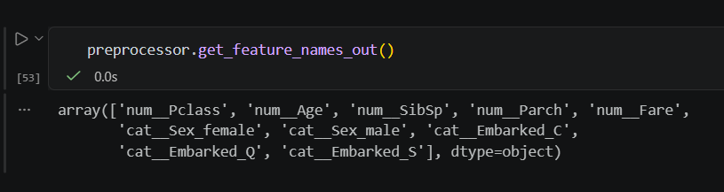
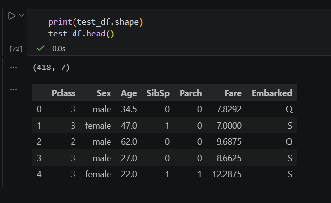

# 🚢 Titanic Data Preprocessing Pipeline

An end-to-end machine learning preprocessing pipeline built using **Scikit-learn Pipelines** and **ColumnTransformer**. This project automates data cleaning and feature engineering while following best practices to prevent **data leakage**.

> **Status:** ✅ Completed (Preprocessing Stage)

---

# 📖 Project Overview

Raw datasets usually contain:

- Missing values
- Categorical features
- Numerical features with different scales

This project demonstrates how to build a reusable preprocessing pipeline that can transform both training data and completely unseen test data using Scikit-learn.

---

# ✨ Features

- ✅ Train-Test Split
- ✅ Automatic detection of numerical and categorical columns
- ✅ Missing value imputation
- ✅ Feature Scaling using MinMaxScaler
- ✅ One-Hot Encoding
- ✅ ColumnTransformer
- ✅ Scikit-learn Pipelines
- ✅ Data Leakage Prevention
- ✅ Processing unseen Kaggle Test Dataset
- ✅ Saving the preprocessing pipeline using Joblib

---

# 🛠️ Technologies Used

- Python
- Pandas
- NumPy
- Scikit-learn
- Joblib
- Jupyter Notebook

---

# 📂 Project Structure

```text
Titanic-Preprocessing-Pipeline/
│
├── assets/
│   ├── Pipeline.png
│   ├── Processed_train_data.png
│   ├── Feature_names.png
│   └── Kaggle_test.png
│
├── data/
│
├── models/
│   └── preprocessor.pkl
│
├── notebook/
│   └── Titanic_Preprocessing_Pipeline.ipynb
│
├── README.md
├── requirements.txt
└── .gitignore
```

---

# ⚙️ Workflow

```text
Raw Dataset
      │
      ▼
Drop Unnecessary Columns
      │
      ▼
Train-Test Split
      │
      ▼
Automatic Column Detection
      │
      ▼
ColumnTransformer
 ├─────────────────────────────┐
 │                             │
 ▼                             ▼
Numerical Pipeline      Categorical Pipeline
 │                             │
 ▼                             ▼
SimpleImputer          SimpleImputer
 │                             │
 ▼                             ▼
MinMaxScaler          OneHotEncoder
 │
 ▼
Processed Dataset
 │
 ▼
Saved as preprocessor.pkl
```

---

# 📸 Project Screenshots

## Preprocessing Pipeline



---

## Processed Training Data



---

## Generated Feature Names



---

## Successfully Processed Kaggle Test Dataset



---

# 🧠 Key Concepts Demonstrated

- Data Preprocessing
- Feature Engineering
- Scikit-learn Pipeline
- ColumnTransformer
- SimpleImputer
- MinMaxScaler
- OneHotEncoder
- Joblib
- Data Leakage Prevention

---

# 🚀 Future Improvements

- Train a Logistic Regression model
- Compare multiple Machine Learning models
- Hyperparameter tuning
- Save the complete preprocessing + model pipeline
- Deploy using Streamlit

---

# ▶️ How to Run

```bash
git clone https://github.com/atshaybudki11-arch/Titanic-Preprocessing-Pipeline.git

cd Titanic-Preprocessing-Pipeline

pip install -r requirements.txt

jupyter notebook
```

Open:

```
notebook/Titanic_Preprocessing_Pipeline.ipynb
```

Run all cells.

---

# 👨‍💻 Author

**Atshay Budki**

B.Tech CSE (AI)

Machine Learning Enthusiast